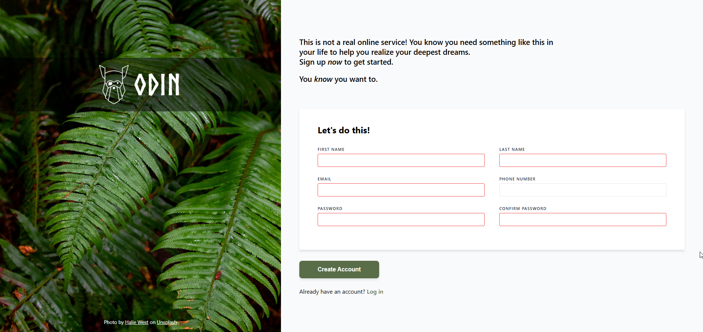

# Sign-Up Form


A responsive sign-up form page created as part of [The Odin Project](https://www.theodinproject.com/) curriculum. This project demonstrates HTML form structure, CSS styling, and form validation using pseudo-classes.

## 🖼️ Preview



## 🌟 Features

- **Split-screen layout** with image sidebar and form section
- **Custom logo** with Norse Bold font from The Odin Project
- **Form validation** with visual feedback:
  - Blue border and shadow on focused inputs (`:focus`)
  - Red border on invalid inputs (`:invalid`)
  - Default light gray border
- **Responsive form fields** organized in two-column layout
- **Clean and modern design** following the provided mockup

## 🛠️ Technologies Used

- HTML5
- CSS3
- Custom Fonts (Norse Bold from CDN)

## 📂 Project Structure

```
odin-project-signup-form/
│
├── 📁 assets/
│   ├── 📁 css/
│   │   └── style.css              # Main stylesheet
│   └── 📁 img/
│       ├── halie-west-25xggax4bSA-unsplash.jpg  # Background image
│       └── odin-lined.png         # Odin logo (optional local copy)
│
├── 📄 index.html                  # Main HTML file
└── 📄 README.md                   # Project documentation
```

## 🎨 Design Details

- **Background Image**: Nature/fern photography from Unsplash
- **Logo**: 
  - SVG from The Odin Project CDN
  - Alternative PNG: `odin-lined.png`
- **Font**: Norse Bold (loaded from CDN)
  ```
  https://cdn.statically.io/gh/TheOdinProject/theodinproject/efdc2888072f409e687d31dc580595dbe4fe0ff4/app/assets/fonts/Norse-Bold.otf
  ```
- **Primary Color**: `#596D48` (Create Account button)
- **Border Colors**: 
  - Default: `#E5E7EB`
  - Focus: `#4F46E5` (blue)
  - Invalid: `#EF4444` (red)

## 🚀 Live Demo

[View Live Demo](https://helmiassura.github.io/odin-project-signup-form/)

## 📝 Installation & Usage

1. **Clone the repository:**
```bash
git clone https://github.com/helmiassura/odin-project-signup-form.git
```

2. **Navigate to the project directory:**
```bash
cd odin-project-signup-form
```

3. **Open in browser:**
   - Simply open `index.html` in your browser, or
   - Use Live Server extension in VS Code for better development experience

## ✨ What I Learned

- 📐 Creating complex form layouts with **CSS Flexbox**
- ✅ Implementing form validation using **CSS pseudo-classes** (`:focus`, `:invalid`)
- 🔤 Working with custom fonts from CDN using **`@font-face`**
- 🖼️ Loading external assets (SVG logo, images) from URLs
- ♿ Structuring accessible HTML forms with proper labels and ARIA attributes
- 🎨 Creating semi-transparent overlays with **`rgba()`**
- ⚡ Using CSS transitions for smooth user interactions
- 📱 Understanding form UX best practices

## 📸 Credits

- **Background Photo**: [Halie West](https://unsplash.com/@haliewestphoto) on [Unsplash](https://unsplash.com/photos/25xggax4bSA)
- **Logo**: [The Odin Project](https://www.theodinproject.com/)
- **Font**: Norse Bold from The Odin Project repository

## 🎯 Project Requirements

This project was built following The Odin Project's assignment guidelines:

| Requirement | Status |
|-------------|--------|
| Form structure with proper input types | ✅ |
| CSS pseudo-classes for validation states | ✅ |
| Custom styling matching design mockup | ✅ |
| Semantic HTML structure | ✅ |
| Split-screen layout (40/60 ratio) | ✅ |
| Password validation (min 8 chars) | ✅ |
| Semi-transparent overlay for logo | ✅ |
| Accessible form labels | ✅ |

## 📜 License

This project is open source and available under the [MIT License](LICENSE).

## 👤 Author

**Muhammad Helmi Assura**

- 🌐 Repository: [odin-project-signup-form](https://github.com/helmiassura/odin-project-signup-form)

## 🙏 Acknowledgments

- [The Odin Project](https://www.theodinproject.com/) for the comprehensive web development curriculum
- [Unsplash](https://unsplash.com/) for free high-quality images
- Halie West for the beautiful fern photography
- The open-source community for inspiration and resources
